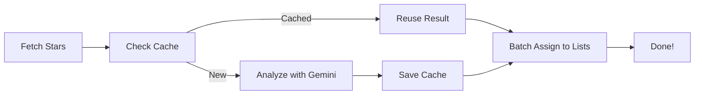

# 🌟 GitHub Stars Categorizer

> Automatically organize your GitHub starred repositories into smart categories using AI

Tired of scrolling through hundreds of starred repos? This CLI tool uses **Gemini 2.5 Flash** to intelligently categorize your GitHub stars into 18 organized lists — automatically.

[](https://www.typescriptlang.org/)
[](https://ai.google.dev/)
[](https://opensource.org/licenses/MIT)


## ✨ Features

- 🤖 **AI-Powered** — Gemini 2.5 Flash analyzes repos by description, language, and topics
- ⚡ **Blazing Fast** — Processes 200 repos in ~12 seconds with batch optimization
- 💰 **Cost-Effective** — ~$0.08 per 200 repos on paid tier, free tier works great
- 💾 **Smart Caching** — Only analyzes new repos, reuses previous categorizations
- 🔄 **Auto-Sync** — GitHub Actions workflow for daily automated updates
- 📊 **18 Categories** — From "AI & LLM" to "Trading & Finance" with emoji prefixes
- 🎯 **Batch Processing** — 10 repos per GraphQL request for optimal performance
- 🔁 **Retry Logic** — Automatic exponential backoff for rate limit handling

## 📦 Quick Start

### Prerequisites

- Node.js 20+
- [GitHub CLI](https://cli.github.com/) authenticated
- [Gemini API key](https://aistudio.google.com/apikey) (free tier available)

### Installation

```bash
# Clone and setup
git clone https://github.com/Brayan233/github-stars-categorizer.git
cd github-stars-categorizer
pnpm install

# Configure
cp .env.example .env
# Add your GEMINI_API_KEY to .env
```

### Usage

```bash
# Categorize all your stars
pnpm categorize

# Dry run first (recommended)
pnpm categorize --dry-run

# Test with a few repos
pnpm categorize --dry-run --limit 10

# Skip cache to re-analyze everything
pnpm categorize --skip-cache

# Keep existing lists instead of clearing
pnpm categorize --keep-lists
```

## 🎯 Categories

Your stars are organized into 18 smart categories:

| Category | Examples |
|----------|----------|
| 🤖 **AI & LLM** | LangChain, OpenAI Node, Vercel AI SDK |
| 🎨 **UI & Design Systems** | shadcn/ui, Tailwind, Radix UI |
| ⚛️ **Frontend Frameworks** | Next.js, Remix, Svelte |
| 🚀 **Backend & Runtimes** | Deno, Hono, tRPC, Payload CMS |
| 🐳 **DevOps & Containers** | Kubernetes, Docker, OrbStack |
| 💻 **CLI & Terminal** | Starship, Zed, Warp |
| 🌐 **Web Scraping & APIs** | Puppeteer, Axios, Crawl4AI |
| 🔍 **Logging & Debug** | PostHog, Sentry, Plausible |
| 🔐 **Databases & Auth** | Prisma, NextAuth, Neon |
| 📚 **Learning Resources** | Awesome lists, tutorials, cheatsheets |
| 🧰 **Utilities & Libraries** | Lodash, Ramda, type-fest |
| ... and 7 more! |

## 🚀 Performance

**Benchmark** (196 repos):
- **Total time**: ~12 seconds
- **Cost**: ~$0.081 (Gemini Flash paid tier)
- **Avg latency**: ~1s per repo
- **Failures**: 0

**How it's optimized**:
- ⚡ 40 concurrent workers (1,000 RPM limit)
- 📦 Batch GitHub API requests (10 repos/request)
- 💾 Permanent analysis cache
- 🔄 Smart retry with exponential backoff

## 🤖 GitHub Actions (Optional)

Automate daily categorization with the included workflow:

```yaml
# .github/workflows/categorize-stars.yml already configured!
# Runs daily at 2 AM UTC
```

**Setup**:
1. Add `GEMINI_API_KEY` to repository secrets
2. Push the workflow file
3. Enable Actions in your repo settings

See [GITHUB-ACTIONS-SETUP.md](GITHUB-ACTIONS-SETUP.md) for full guide.

## 📊 How It Works



1. **Fetch** starred repos from GitHub API (cached 24h)
2. **Analyze** with Gemini Flash (~1s per repo, thinking disabled for speed)
3. **Cache** results permanently (only new repos analyzed on re-runs)
4. **Sync** to GitHub Lists in batches of 10

## ⚙️ Configuration

All settings optional (sane defaults provided):

```env
# Required
GEMINI_API_KEY=your_key_here

# Optional (defaults shown)
CACHE_MAX_AGE_HOURS=360  # 15 days
CATEGORIZER_CONCURRENCY=40
GEMINI_MODEL=gemini-2.5-flash
RETRY_DELAY_MS=1000
RETRY_MAX_ATTEMPTS=5
```

**Model options**:
- `gemini-2.5-flash` — Fast & cheap (~1s/repo) **← Recommended**
- `gemini-2.5-pro` — Slower but more accurate (~15s/repo)

## 💡 Pro Tips

**First run** (200 repos):
- Takes ~12 seconds total
- Costs ~$0.08 (Flash paid tier)
- Free tier: ~2-3 minutes (10 RPM limit)

**Subsequent runs** (+10 new repos):
- Only analyzes NEW repos (~1 second)
- Reuses cache for existing 190 repos
- Almost instant! ⚡

**Save money**:
```bash
# Run weekly instead of daily
0 2 * * 0 pnpm categorize  # Every Sunday
```

## 📚 Documentation

- [READY-TO-USE.md](READY-TO-USE.md) — Quick start guide
- [GITHUB-ACTIONS-SETUP.md](GITHUB-ACTIONS-SETUP.md) — Automation guide
- [POSTHOG-SETUP.md](POSTHOG-SETUP.md) — Analytics setup (optional)
- [CHANGELOG.md](CHANGELOG.md) — Version history

## 🐛 Troubleshooting

**"Configuration Error: GEMINI_API_KEY is required"**
```bash
# Get API key from https://aistudio.google.com/apikey
echo "GEMINI_API_KEY=your_key" >> .env
```

**"gh: command not found"**
```bash
# Install GitHub CLI
brew install gh  # macOS
# Then authenticate
gh auth login
```

**Rate limit errors**
- Free tier: Reduce `CATEGORIZER_CONCURRENCY` to 5
- Or wait 1 minute and retry (automatic exponential backoff)

## 🤝 Contributing

Contributions welcome! Feel free to:
- Report bugs
- Suggest new categories
- Improve performance
- Add features

## 📄 License

MIT © Brayan Oduro

---

**Made with ❤️ using [Gemini 2.5 Flash](https://ai.google.dev/)**
